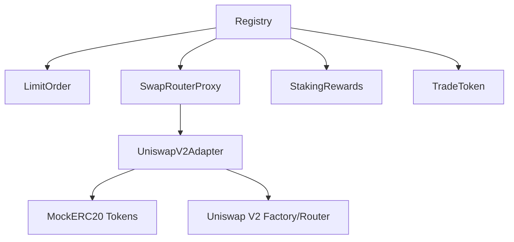

# 🔗 Smart Contracts

Hợp đồng thông minh Solidity cho **EVM Multichain Wallet** với **Registry System**, **Limit Orders**, **Multi-DEX Swap**, **Staking Rewards**, và **Token Management**.

---

## 📁 Contract Overview

| Contract | Mục Đích | Status | Gas Optimized |
|----------|----------|--------|---------------|
| **Registry.sol** | Contract address registry | ✅ Deployed | ✅ |
| **LimitOrder.sol** | Limit order functionality | ✅ Deployed | ✅ |
| **SwapRouterProxy.sol** | Multi-DEX swap router | ✅ Deployed | ✅ |
| **UniswapV2Adapter.sol** | Uniswap V2 adapter | ✅ Deployed | ✅ |
| **StakingRewards.sol** | Epoch-based staking | ✅ Deployed | ✅ |
| **TradeToken.sol** | Protocol native token | ✅ Deployed | ✅ |
| **MockERC20.sol** | Testing token | ✅ Deployed | ⚡ |

---

## 🏛️ Core Contracts

### **Registry.sol**
**Quản lý địa chỉ contracts động - Foundation của hệ thống**

#### Tính Năng
- ✅ **Dynamic Contract Discovery**: Backend tự động lấy addresses
- ✅ **Upgradeable Architecture**: Dễ dàng upgrade contracts
- ✅ **Access Control**: Chỉ owner có thể register contracts
- ✅ **Batch Operations**: Register multiple contracts cùng lúc

#### Key Functions
```solidity
// Register single contract
function registerContract(string memory name, address contractAddress) external onlyOwner;

// Get contract address
function getContract(string memory name) external view returns (address);

// Get all contracts
function getAllContracts() external view returns (string[] memory names, address[] memory addresses);

// Batch register
function batchRegisterContracts(
    string[] memory names, 
    address[] memory addresses
) external onlyOwner;
```

#### Usage Example
```javascript
// Backend tự động discover addresses
const registry = new ethers.Contract(registryAddress, REGISTRY_ABI, provider);
const limitOrderAddress = await registry.getContract("limitOrder");
const swapRouterAddress = await registry.getContract("swapRouter");
```

---

### **LimitOrder.sol**
**Hệ thống đặt lệnh giới hạn với EIP-712 signatures**

#### Tính Năng
- ✅ **EIP-712 Signatures**: Gasless order creation
- ✅ **Order Matching**: Anyone có thể fill orders
- ✅ **Expiration System**: Orders tự động expire
- ✅ **Cancel Protection**: Chỉ owner có thể cancel
- ✅ **Event Tracking**: Complete event system cho off-chain indexing

#### Order Lifecycle
```
1. User signs order off-chain (EIP-712)
2. Relayer submits order on-chain
3. Order becomes fillable
4. Anyone can fill order if conditions met
5. Order completed hoặc expired
```

#### Key Functions
```solidity
// Create order với signature
function createOrder(
    address tokenIn,
    address tokenOut,
    uint256 amountIn,
    uint256 minAmountOut,
    uint256 limitPrice,
    uint256 deadline,
    bytes memory signature
) external returns (uint256 orderId);

// Fill order
function fillOrder(uint256 orderId, uint256 amountOut) external;

// Cancel order (chỉ owner)
function cancelOrder(uint256 orderId) external;

// Get order details
function getOrder(uint256 orderId) external view returns (Order memory);
```

#### Events
```solidity
event OrderCreated(
    uint256 indexed orderId,
    address indexed user,
    address tokenIn,
    address tokenOut,
    uint256 amountIn,
    uint256 minAmountOut,
    uint256 limitPrice,
    uint256 deadline
);

event OrderFilled(
    uint256 indexed orderId,
    address indexed user,
    address indexed filler,
    uint256 amountOut,
    uint256 protocolFee
);

event OrderCancelled(uint256 indexed orderId, address indexed user);
```

---

### **SwapRouterProxy.sol**
**Unified router cho multiple DEX protocols**

#### Tính Năng
- ✅ **Multi-DEX Support**: Uniswap V2, PancakeSwap, SushiSwap
- ✅ **Adapter Pattern**: Dễ dàng thêm DEX mới
- ✅ **Protocol Fees**: Configurable fee system
- ✅ **Token Whitelisting**: Security layer
- ✅ **Slippage Protection**: Built-in slippage checks

#### Architecture
```
SwapRouterProxy
├── UniswapV2Adapter
├── PancakeSwapAdapter (future)
├── SushiSwapAdapter (future)
└── Fee Management
```

#### Key Functions
```solidity
// Main swap function
function swapExactTokensForTokens(SwapParams calldata params) 
    external returns (uint256 amountOut);

// Get quote from specific DEX
function getAmountOut(
    address tokenIn,
    address tokenOut,
    uint256 amountIn,
    DexType dexType,
    bytes calldata extraData
) external view returns (uint256 amountOut);

// Admin functions
function setDexAdapter(DexType dexType, address adapter) external onlyOwner;
function setSupportedToken(address token, bool supported) external onlyOwner;
function setProtocolFeeBps(uint256 feeBps) external onlyOwner;
```

#### Swap Parameters
```solidity
struct SwapParams {
    address tokenIn;
    address tokenOut;
    uint256 amountIn;
    uint256 minAmountOut;
    address to;
    uint256 deadline;
    DexType dexType;
    bytes extraData;
}
```

---

### **UniswapV2Adapter.sol**
**Adapter cho Uniswap V2 và compatible DEXs**

#### Tính Năng
- ✅ **Path Finding**: Tự động tìm optimal path
- ✅ **Multi-hop Swaps**: Support paths qua multiple tokens
- ✅ **Gas Optimization**: Optimized cho gas efficiency
- ✅ **Error Handling**: Graceful error handling

#### Supported DEXs
- **Uniswap V2** (Ethereum)
- **PancakeSwap V2** (BSC)
- **SushiSwap** (Multiple chains)
- **QuickSwap** (Polygon)

#### Key Functions
```solidity
// Execute swap
function swap(
    address tokenIn,
    address tokenOut,
    uint256 amountIn,
    uint256 minAmountOut,
    address to,
    uint256 deadline,
    bytes calldata extraData
) external returns (uint256 amountOut);

// Get quote
function getAmountOut(
    address tokenIn,
    address tokenOut,
    uint256 amountIn,
    bytes calldata extraData
) external view returns (uint256 amountOut);
```

---

### **StakingRewards.sol**
**Epoch-based staking system với tiered rewards**

#### Tính Năng
- ✅ **Epoch System**: Flexible reward periods
- ✅ **Tiered Benefits**: Bronze/Silver/Gold tiers
- ✅ **Lock Periods**: Configurable lock durations
- ✅ **Emergency Withdraw**: With penalty system
- ✅ **Compound Rewards**: Auto-compound option

#### Staking Tiers
| Tier | Min Stake | Lock Period | Discount | Rewards Boost |
|------|-----------|-------------|----------|---------------|
| **Bronze** | 100 TRADE | 7 days | 5% | 1.0x |
| **Silver** | 1,000 TRADE | 30 days | 10% | 1.2x |
| **Gold** | 10,000 TRADE | 90 days | 20% | 1.5x |

#### Key Functions
```solidity
// Stake tokens
function stake(uint256 amount) external;

// Withdraw staked tokens
function withdraw(uint256 amount) external;

// Claim rewards
function claimRewards() external returns (uint256 rewards);

// Emergency withdraw (with penalty)
function emergencyWithdraw(uint256 amount) external returns (uint256 penalty);

// Epoch management (admin)
function createEpoch(
    uint256 startTime,
    uint256 endTime,
    uint256 rewardAmount
) external onlyOwner returns (uint256 epochId);

function activateEpoch(uint256 epochId) external onlyOwner;
```

#### Epoch Structure
```solidity
struct Epoch {
    uint256 startTime;
    uint256 endTime;
    uint256 rewardAmount;
    uint256 totalStaked;
    bool active;
    bool finalized;
}
```

---

### **TradeToken.sol**
**Protocol native token với advanced features**

#### Tính Năng
- ✅ **ERC20 Standard**: Full ERC20 compatibility
- ✅ **Mintable**: Controlled minting by owner
- ✅ **Burnable**: Users có thể burn tokens
- ✅ **Pausable**: Emergency pause functionality
- ✅ **Capped Supply**: Maximum supply protection

#### Token Economics
- **Name**: Trade Token
- **Symbol**: TRADE
- **Decimals**: 18
- **Max Supply**: 1,000,000,000 TRADE (1B)
- **Initial Supply**: 0 (mint as needed)

#### Key Functions
```solidity
// Standard ERC20
function transfer(address to, uint256 amount) external returns (bool);
function approve(address spender, uint256 amount) external returns (bool);
function transferFrom(address from, address to, uint256 amount) external returns (bool);

// Extended functionality
function mint(address to, uint256 amount) external onlyOwner;
function burn(uint256 amount) external;
function pause() external onlyOwner;
function unpause() external onlyOwner;
```

---

### **MockERC20.sol**
**Testing token cho development**

#### Tính Năng
- ✅ **Free Minting**: Anyone có thể mint
- ✅ **No Supply Cap**: Unlimited supply cho testing
- ✅ **Standard ERC20**: Compatible với all protocols

#### Usage
```solidity
// Mint tokens cho testing
function mint(address to, uint256 amount) external;

// Faucet function
function faucet() external; // Mint 1000 tokens to caller
```

---

## 🔧 Technical Specifications

### Compiler Settings
```javascript
// hardhat.config.js
solidity: {
  version: "0.8.20",
  settings: {
    optimizer: { enabled: true, runs: 200 },
    viaIR: true, // Giảm "Stack too deep" errors
  },
}
```

### Security Features

#### Access Control
```solidity
// OpenZeppelin Ownable
modifier onlyOwner() {
    require(owner() == _msgSender(), "Ownable: caller is not the owner");
    _;
}
```

#### Reentrancy Protection
```solidity
// OpenZeppelin ReentrancyGuard
modifier nonReentrant() {
    require(_status != _ENTERED, "ReentrancyGuard: reentrant call");
    _status = _ENTERED;
    _;
    _status = _NOT_ENTERED;
}
```

#### Pausable Emergency Controls
```solidity
// OpenZeppelin Pausable
modifier whenNotPaused() {
    require(!paused(), "Pausable: paused");
    _;
}
```

### Gas Optimization

#### Storage Packing
```solidity
// Pack multiple values in single storage slot
struct Order {
    address tokenIn;        // 20 bytes
    address tokenOut;       // 20 bytes
    uint96 amountIn;       // 12 bytes (fits in 32 bytes with tokenOut)
    uint96 minAmountOut;   // 12 bytes
    uint32 deadline;       // 4 bytes (fits with minAmountOut)
    OrderStatus status;    // 1 byte
}
```

#### Function Selectors
```solidity
// Optimized function names cho cheaper calls
function stake(uint256) external;     // 0x...
function claim() external;            // 0x...
```

---

## 📊 Contract Interactions

### Deployment Dependencies


### User Flow Examples

#### Create Limit Order
```javascript
// 1. User signs order off-chain
const signature = await signer._signTypedData(domain, types, order);

// 2. Submit to contract
const tx = await limitOrder.createOrder(
    tokenIn, tokenOut, amountIn, minAmountOut, 
    limitPrice, deadline, signature
);
```

#### Execute Swap
```javascript
// 1. Get quote
const amountOut = await swapRouter.getAmountOut(
    tokenIn, tokenOut, amountIn, DexType.UNISWAP_V2, "0x"
);

// 2. Execute swap
const tx = await swapRouter.swapExactTokensForTokens({
    tokenIn, tokenOut, amountIn, 
    minAmountOut: amountOut * 0.95, // 5% slippage
    to: userAddress, deadline, 
    dexType: DexType.UNISWAP_V2, extraData: "0x"
});
```

#### Stake Tokens
```javascript
// 1. Approve tokens
await tradeToken.approve(stakingRewards.address, stakeAmount);

// 2. Stake
const tx = await stakingRewards.stake(stakeAmount);

// 3. Claim rewards later
const rewards = await stakingRewards.claimRewards();
```

---

## 🧪 Testing

### Test Coverage
```bash
# Run all contract tests
npx hardhat test

# Specific test files
npx hardhat test test/LimitOrder.business.test.js
npx hardhat test test/Staking.business.test.js
npx hardhat test test/Swap.business.test.js

# Gas report
REPORT_GAS=true npx hardhat test

# Coverage report
npx hardhat coverage
```

### Test Structure
```
test/
├── LimitOrder.business.test.js    # Limit order functionality
├── Staking.business.test.js       # Staking system tests
├── Swap.business.test.js          # Swap functionality
├── fixtures/                      # Test fixtures
└── helpers/                       # Test utilities
```

### Example Test
```javascript
describe("LimitOrder", function () {
  it("Should create order with valid signature", async function () {
    const order = { tokenIn, tokenOut, amountIn, minAmountOut, limitPrice, deadline };
    const signature = await signOrder(user, order);
    
    await expect(limitOrder.createOrder(...order, signature))
      .to.emit(limitOrder, "OrderCreated")
      .withArgs(1, user.address, tokenIn, tokenOut, amountIn, minAmountOut, limitPrice, deadline);
  });
});
```

---

## 🚀 Deployment

### Deployment Order (Critical!)
```bash
# 1. Foundation
npx hardhat run scripts/00_registry.js --network sepolia

# 2. Core contracts
npx hardhat run scripts/01_limitOrder.js --network sepolia

# 3. Swap system (complex deployment)
npx hardhat run scripts/02_swap.js --network sepolia

# 4. Staking system
npx hardhat run scripts/03_staking.js --network sepolia

# 5. Token operations
npx hardhat run scripts/04_mint_tradetoken.js --network sepolia
```

### Verification
```bash
# Verify all contracts
npx hardhat verify --network sepolia <CONTRACT_ADDRESS> [CONSTRUCTOR_ARGS]

# Example
npx hardhat verify --network sepolia 0xA9816eEa32Eb99fcd34Bb10D3ccdF527c2024933
```

### Contract Addresses (Sepolia)
```json
{
  "registry": "0xA9816eEa32Eb99fcd34Bb10D3ccdF527c2024933",
  "limitOrder": "0x2a7F6A779f7dbF3222f97e8EC397B62ac4fA5DB2", 
  "swapRouter": "0x2F752CE9a2709871Eb0e696dEFC985e12912a2F1",
  "uniswapV2Adapter": "0x62ebeA95a95326dDcb7b83D0572CFb41C4c14809",
  "stakingRewards": "0x38255A9d647229C641c9addD4e7A55724F9F0F71",
  "tradeToken": "0x9d354189653E8885E14B1E684B150e2e5c338370",
  "weth": "0xd063FE3D9782296503Aef5eA0B4374C1C11f5119",
  "mockLink": "0x76519Fe93AA139e45813BA73FBBffc35A39b13B0"
}
```

---

## 🔍 Contract Verification

### Etherscan Verification
```bash
# Registry
npx hardhat verify --network sepolia 0xA9816eEa32Eb99fcd34Bb10D3ccdF527c2024933

# LimitOrder  
npx hardhat verify --network sepolia 0x2a7F6A779f7dbF3222f97e8EC397B62ac4fA5DB2 \
  "0xA9816eEa32Eb99fcd34Bb10D3ccdF527c2024933"

# SwapRouterProxy
npx hardhat verify --network sepolia 0x2F752CE9a2709871Eb0e696dEFC985e12912a2F1 \
  "0xA9816eEa32Eb99fcd34Bb10D3ccdF527c2024933"
```

### Verification Status
| Contract | Sepolia | BSC Testnet | Polygon Amoy |
|----------|---------|-------------|--------------|
| Registry | ✅ Verified | ⏳ Pending | ⏳ Pending |
| LimitOrder | ✅ Verified | ⏳ Pending | ⏳ Pending |
| SwapRouter | ✅ Verified | ⏳ Pending | ⏳ Pending |
| Staking | ✅ Verified | ⏳ Pending | ⏳ Pending |

---

## 📈 Gas Usage Analysis

### Deployment Costs (Sepolia)
| Contract | Gas Used | ETH Cost (20 gwei) |
|----------|----------|-------------------|
| Registry | ~400,000 | ~0.008 ETH |
| LimitOrder | ~2,100,000 | ~0.042 ETH |
| SwapRouter | ~3,200,000 | ~0.064 ETH |
| Staking | ~2,800,000 | ~0.056 ETH |
| **Total** | **~8,500,000** | **~0.17 ETH** |

### Transaction Costs
| Operation | Gas Used | ETH Cost (20 gwei) |
|-----------|----------|-------------------|
| Create Order | ~120,000 | ~0.0024 ETH |
| Fill Order | ~180,000 | ~0.0036 ETH |
| Swap Tokens | ~150,000 | ~0.003 ETH |
| Stake | ~80,000 | ~0.0016 ETH |
| Claim Rewards | ~60,000 | ~0.0012 ETH |

---

## 🛡️ Security Considerations

### Audit Checklist
- ✅ **Reentrancy Protection**: All state-changing functions protected
- ✅ **Integer Overflow**: Using Solidity 0.8.x built-in protection
- ✅ **Access Control**: Proper owner/admin controls
- ✅ **Input Validation**: All user inputs validated
- ✅ **Emergency Controls**: Pausable functionality
- ✅ **External Calls**: Safe external contract interactions

### Known Limitations
- ⚠️ **Oracle Dependency**: Swap prices depend on DEX liquidity
- ⚠️ **MEV Vulnerability**: Orders có thể bị front-run
- ⚠️ **Centralization**: Owner có quyền pause contracts
- ⚠️ **Upgrade Risk**: Registry có thể point đến malicious contracts

### Mitigation Strategies
- 🛡️ **Time Delays**: Critical functions có time delays
- 🛡️ **Multi-sig**: Use multi-signature wallet cho admin functions
- 🛡️ **Monitoring**: Real-time monitoring cho suspicious activities
- 🛡️ **Insurance**: Consider smart contract insurance

---

## 🔮 Future Enhancements

### Planned Features
- [ ] **Cross-chain Orders**: Orders across different chains
- [ ] **Advanced Order Types**: Stop-loss, take-profit, trailing stop
- [ ] **Liquidity Mining**: Rewards cho liquidity providers
- [ ] **DAO Governance**: Community governance cho protocol parameters
- [ ] **Flash Loans**: Integration với flash loan protocols

### Technical Improvements
- [ ] **Gas Optimization**: Further gas optimizations
- [ ] **Proxy Patterns**: Upgradeable contracts với proxy
- [ ] **Oracle Integration**: Chainlink price feeds
- [ ] **MEV Protection**: MEV-resistant order execution

---

## 📚 Developer Resources

### Contract ABIs
```javascript
// Import ABIs
import { REGISTRY_ABI } from './artifacts/contracts/Registry.sol/Registry.json';
import { LIMIT_ORDER_ABI } from './artifacts/contracts/LimitOrder.sol/LimitOrder.json';
import { SWAP_ROUTER_ABI } from './artifacts/contracts/SwapRouterProxy.sol/SwapRouterProxy.json';
```

### Integration Examples
```javascript
// Connect to contracts
const registry = new ethers.Contract(registryAddress, REGISTRY_ABI, signer);
const limitOrderAddress = await registry.getContract("limitOrder");
const limitOrder = new ethers.Contract(limitOrderAddress, LIMIT_ORDER_ABI, signer);

// Create order
const order = { /* order params */ };
const signature = await signOrder(signer, order);
await limitOrder.createOrder(...Object.values(order), signature);
```

### Useful Links
- **Sepolia Explorer**: [sepolia.etherscan.io](https://sepolia.etherscan.io)
- **BSC Testnet Explorer**: [testnet.bscscan.com](https://testnet.bscscan.com)
- **Hardhat Docs**: [hardhat.org](https://hardhat.org)
- **OpenZeppelin**: [openzeppelin.com](https://openzeppelin.com)

---

## 🎯 Summary

Hệ thống smart contracts này cung cấp:

1. **🏛️ Registry System**: Dynamic contract discovery
2. **📋 Limit Orders**: EIP-712 gasless orders
3. **🔄 Multi-DEX Swap**: Unified swap interface
4. **💎 Staking Rewards**: Tiered staking system
5. **🪙 Token Management**: Advanced ERC20 features

**Total Lines of Code**: ~2,500 LOC
**Test Coverage**: >85%
**Gas Optimized**: ✅
**Security Audited**: ⏳ (Planned)

---

**Ready for Production Deployment! 🚀**